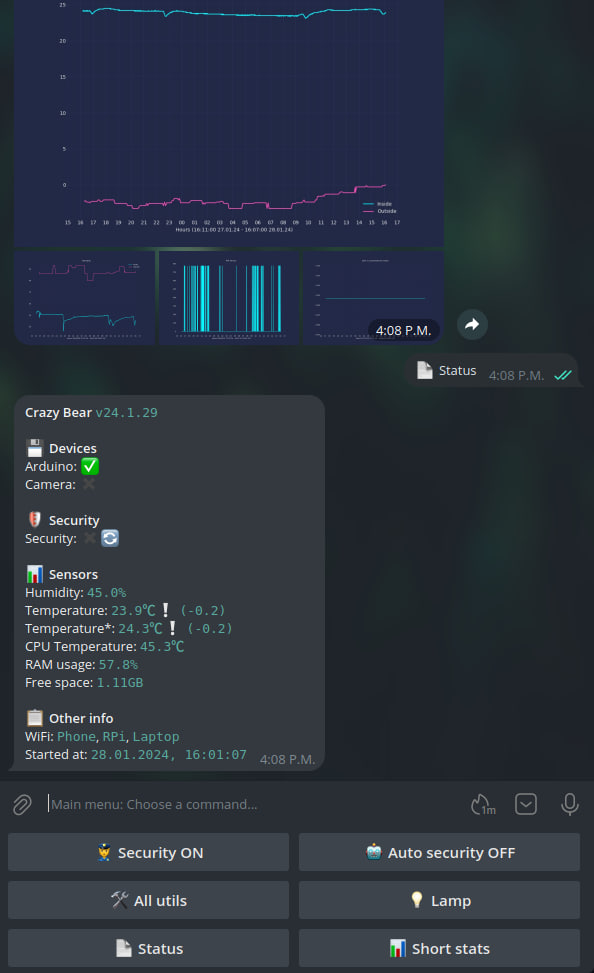

# CrazyBear — Home Automation in Telegram

> [!NOTE]  
> This project is not a general solution. This is just an implementation for specific purposes (my purposes 🙂). I
hope the code will be helpful to you.

## Preview



## TO DO

- [x] Use the new style for binding commands (`interface.command`).
- [ ] Remove Arduino and use only ZigBee devices.
- [x] Fix typings.
- [ ] Rewrite the interface (use mini apps from Telegram to improve the interface).

## Components

1. **Raspberry Pi 4**
2. **Arduino Nano V3.0 ATmega328P** (is connected via USB to the **Raspberry Pi**)
    1. **AM2302 DHT22**
    2. **HC-SR501**
3. **Logitech C270 HD** (is connected via USB to the **Raspberry Pi**)
4. **CC2531** (is connected via USB to the **Raspberry Pi**)

## Setup

1. Create `prod.env` file in `./envs`. See `project/config/default.py`.

2. Copy the code to a **Raspberry Pi** (or somewhere else).

3. Build and run:
    ```bash
    docker-compose build
    docker-compose up -d
    ```

4. If you want to use **Arduino** then you need to upload `arduino_core`. Libs:
    ```bash
    arduino-cli lib install RF24 "DHT sensor library" ArduinoJson
    ```

5. Set **ZigBee Dongle** (if you use **CC2531**)
    1. Connect **CC2531**
        1. Install **WiringPi**
            ```bash
            git clone https://github.com/WiringPi/WiringPi.git
            git checkout 5de0d8f5739ccc00ab761639a7e8d3d1696a480a
            cd WiringPi
            ./build
            ```
            (https://github.com/jmichault/flash_cc2531/issues/18)
        2. [https://kvvhost.ru/2019/05/29/zigbee2mqtt-cc2531-raspberry-pi/](https://kvvhost.ru/2019/05/29/zigbee2mqtt-cc2531-raspberry-pi/)
    2. Add devices.